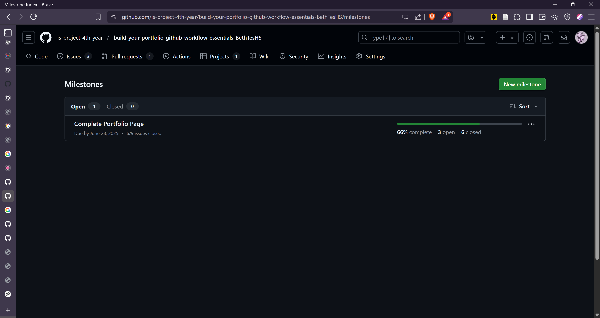
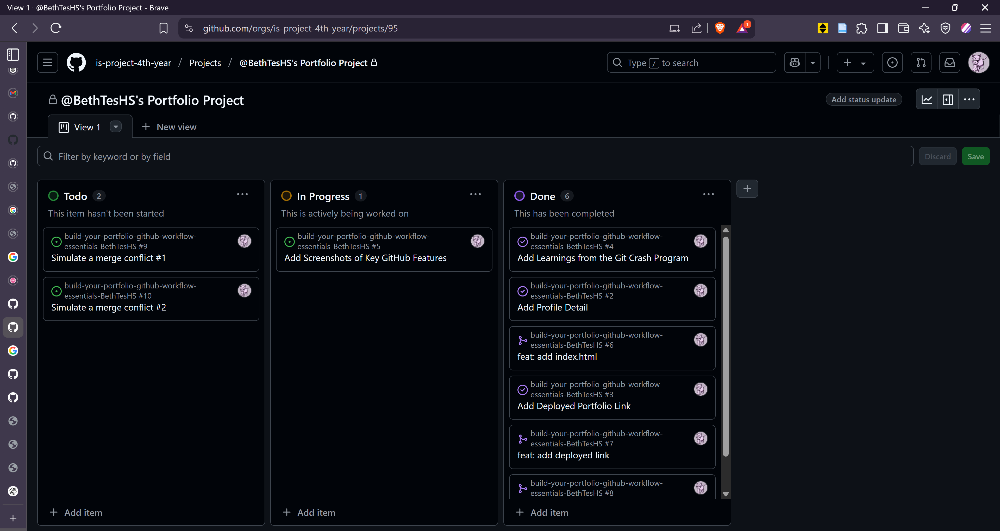
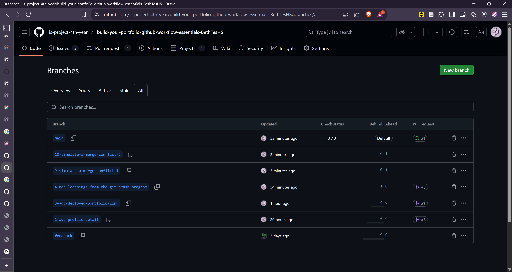
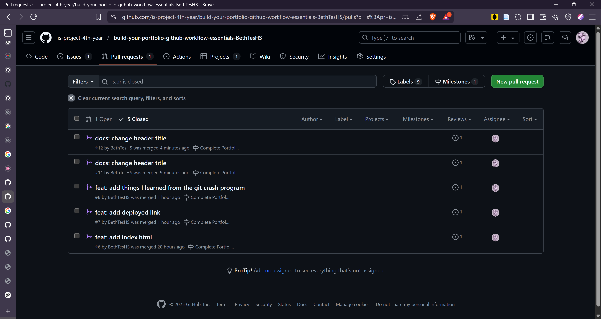
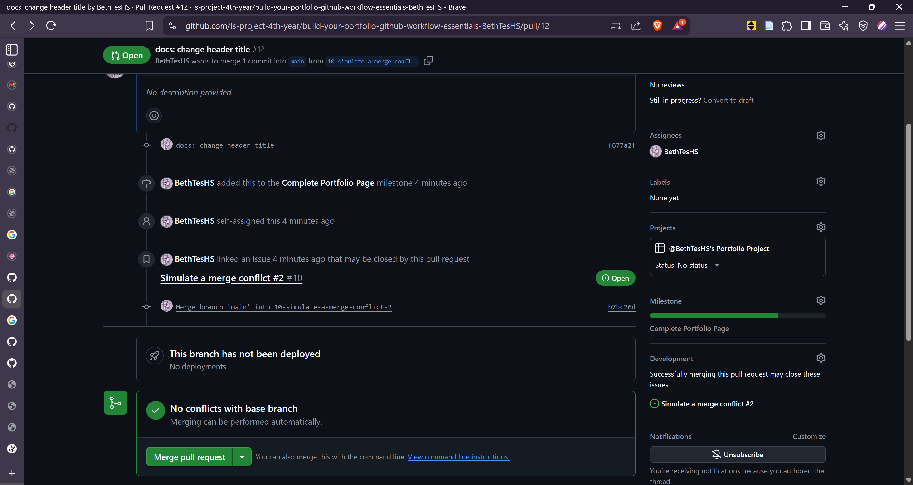
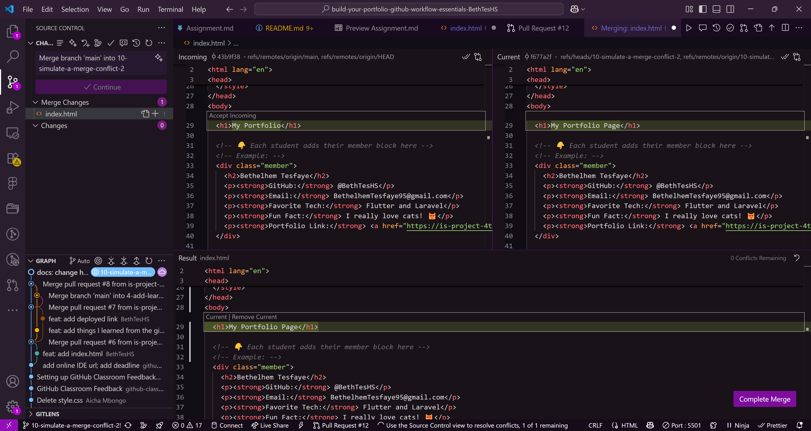

# Personal Portfolio Documentation

## 1. Student Details

- **Full Name**: Bethelhem Tesfaye Haileselassie
- **GitHub Username**: BethTesHS
- **Email**: bethelhemtesfaye95@gmail.com

## 2. Deployed Portfolio Link

- **GitHub Pages URL**:  
  https://is-project-4th-year.github.io/build-your-portfolio-github-workflow-essentials-BethTesHS

## 3. Learnings from the Git Crash Program

List at least **four key concepts or skills** you learned during the Git crash course. For each one, write a brief explanation of how it helped you manage your portfolio project more effectively.

Example format:

- **Branching**: Helped me separate features and prevent conflicts when working on different sections of the site.

- **Merging** : Enabled me to combine branches back into the main branch safely, while ensuring that any potential conflicts are resolved accordingly.

- **Commit Messages**: Taught me to write clear, descriptive commit messages, making it easier to track changes and understand what each update in my project did.

- **Milestones** : Allowed me to set clear goals for my project, helping me track progress and stay organized during development.

- **Issues** : Enabled me to log bugs or tasks so I could address them in an orderly manner

- **Projects** : Provided a kanban-style board to visually organize tasks, issues, and milestones for projects, making it easier to manage priorities and see what is in progress, blocked, or completed.

## 4. Screenshots of Key GitHub Features

Include screenshots that demonstrate how you used GitHub to manage your project. For each screenshot, write a short caption explaining what it shows.

> Upload the screenshots to your GitHub repository and reference them here using Markdown image syntax:
> (you could just simply copy and paste the image into the Assignment.md)

```markdown

```

### A. Milestones and Issues

### Milestones


### Issues


### B. Project Board



### C. Branching



### D. Pull Requests



### E. Merge Conflict Resolution


### Before Resolution


### After Resolution


### Conflict Resolving Page

